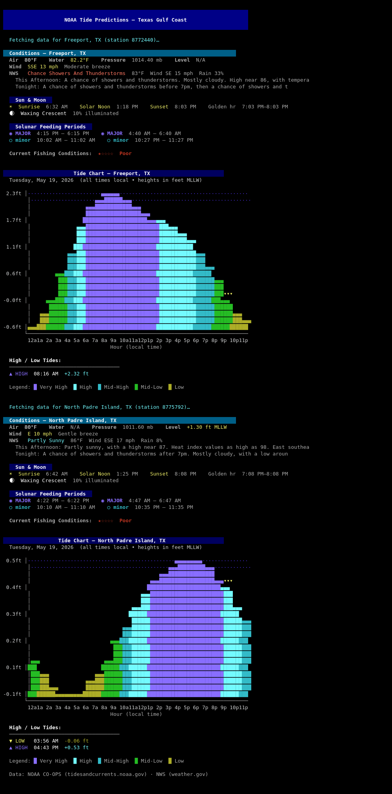
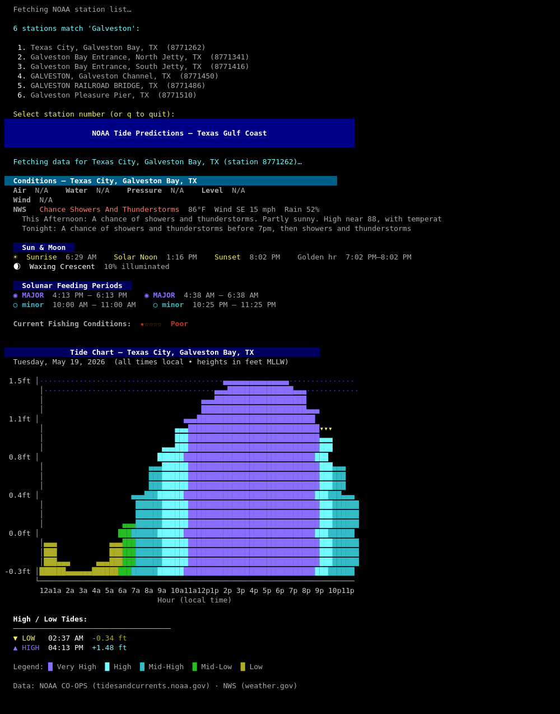
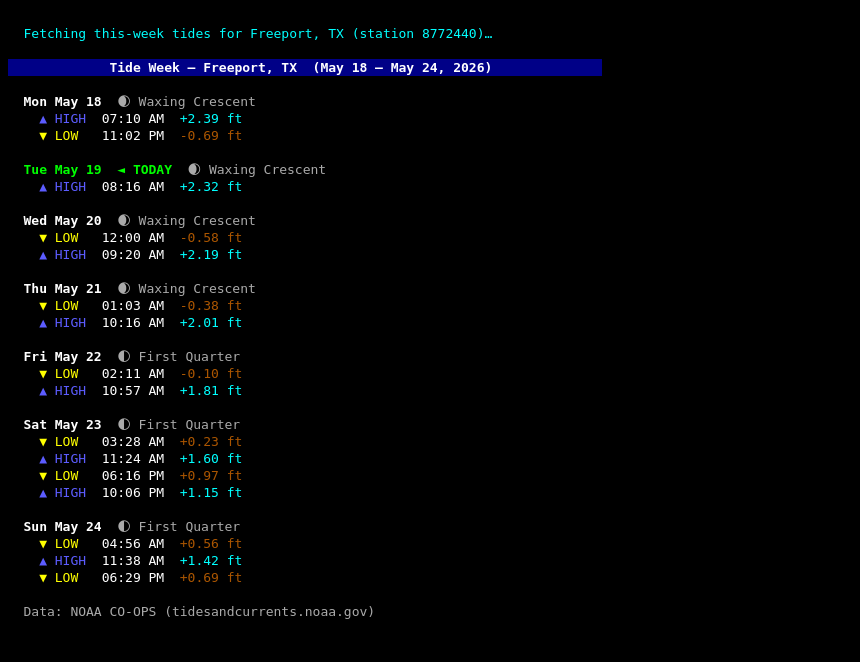

# console-tides

A zero-dependency Python console app that pulls live NOAA data and renders a full-colour tide chart + conditions dashboard directly in your terminal. No browser needed — just a Python 3 install.

---

## What it shows

| Section | Details |
|---|---|
| **Conditions** | Air & water temp, wind speed/direction/gusts, Beaufort description, barometric pressure, observed water level |
| **NWS weather** | Current hourly forecast + 2-period outlook from National Weather Service |
| **Sun & Moon** | Sunrise, solar noon, sunset, golden hour, moon phase + illumination |
| **Solunar periods** | Major (2-hour) and minor (1-hour) feeding windows; live "◀ NOW" marker during active periods |
| **Fishing rating** | 1–5 star rating calculated from tide stage, wind speed, and solunar alignment |
| **Tide chart** | 24-hour ANSI bar chart with colour-coded water height, current-hour marker, and hi/lo table |

---

## Screenshots

**Default view — Freeport, TX + North Padre Island, TX (`--padre`)**



**Station search — Galveston area (`--search "Galveston"`)**



**Week view — Freeport, TX (`--week`)**



---

## Requirements

- Python 3.10+
- Standard library only — `urllib`, `json`, `math`, `concurrent.futures`, `argparse`
- A terminal that supports ANSI 256-colour codes (any modern terminal: iTerm2, GNOME Terminal, Windows Terminal, alacritty, Kitty, etc.)

---

## Installation

```bash
# Clone
git clone https://github.com/SilasMarner/console-tides.git
cd console-tides

# Optional: put it on your PATH
chmod +x tides.py
cp tides.py ~/.local/bin/tides   # or any directory in $PATH
```

No pip install required — the script uses only Python stdlib.

---

## Usage

```bash
# Default: shows Freeport, TX with interactive date and station prompts
python3 tides.py

# Show both default stations (Freeport + North Padre Island)
python3 tides.py --padre

# Search any of ~3,450 NOAA stations by city or name
python3 tides.py --search "Corpus Christi"
python3 tides.py --search "Port Aransas"
python3 tides.py -s "Pensacola"

# Jump straight to a station by NOAA ID (skip search)
python3 tides.py --id 8771450            # Galveston Channel

# Show a specific date instead of today
python3 tides.py --date 2026-07-04
python3 tides.py -p --date 2026-07-04   # both default stations, July 4th

# Show a full week of hi/lo tides (compact table, no chart)
python3 tides.py --week            # this week (Mon–Sun)
python3 tides.py --week next       # next week
python3 tides.py --week last       # last week
python3 tides.py -w next           # short flag

# Combine flags
python3 tides.py --search "Mobile" --date 2026-06-15
python3 tides.py --search "Galveston" --week next
```

When run with no flags the script enters interactive mode and prompts for both the date and station.

---

## Flags

| Flag | Short | Description |
|---|---|---|
| `--padre` | `-p` | Include North Padre Island, TX alongside Freeport |
| `--search QUERY` | `-s` | Search NOAA stations by city, partial name, or 2-letter state code |
| `--id STATION_ID` | | Use a NOAA station ID directly — skip the search list |
| `--date YYYY-MM-DD` | `-d` | Show predictions for a specific date (default: today) |
| `--week [this\|next\|last]` | `-w` | Show a compact 7-day hi/lo tide table; bare `--week` defaults to this week |

---

## How to add or change your default stations

The default stations are defined in the `STATIONS` dictionary near the top of `tides.py`. Edit this block to add any NOAA stations you care about:

```python
# ── Station config ────────────────────────────────────────────────────────────
STATIONS = {
    "Freeport, TX": {
        "id":     "8772440",   # NOAA station ID
        "lat":    28.9543,     # latitude  (used for sun/solunar math)
        "lon":    -95.3677,    # longitude (used for sun/solunar math)
        "met_id": "8771341",   # nearest full met station (wind, air temp, pressure)
        "nws":    "https://api.weather.gov/points/28.9543,-95.3677",
    },
    "North Padre Island, TX": {
        "id":     "8775792",
        "lat":    27.5800,
        "lon":    -97.2270,
        "met_id": "8775241",   # Aransas Pass
        "nws":    "https://api.weather.gov/points/27.5800,-97.2270",
    },
}
```

### Step 1 — Find your station IDs

Run an interactive search:

```bash
python3 tides.py --search "Port Isabel"
```

The script will list matching stations with their IDs. Note the **tide station ID** (e.g. `8779770`).

You can also browse the full list at [tidesandcurrents.noaa.gov/stations.html](https://tidesandcurrents.noaa.gov/stations.html) — filter by state and look for "Tide Predictions" stations.

### Step 2 — Find the nearest met station

The `met_id` supplies wind, air temperature, and barometric pressure. Tide-only stations often lack these sensors. To find a nearby full met station:

1. Go to [tidesandcurrents.noaa.gov](https://tidesandcurrents.noaa.gov)
2. Click your desired location on the map
3. Look for a nearby station that shows "Meteorological Observations" in its product list
4. Use that station's ID as `met_id`

If you can't find one nearby, set `"met_id"` to the same value as `"id"` — conditions will show `N/A` for met fields but the tide chart will still work.

### Step 3 — Build the NWS URL

The `nws` key points to the National Weather Service grid lookup endpoint. Replace the lat/lon in the URL with your station's coordinates:

```
https://api.weather.gov/points/<lat>,<lon>
```

Example for Port Isabel, TX (lat 26.0637, lon -97.2069):
```
https://api.weather.gov/points/26.0637,-97.2069
```

### Step 4 — Add the entry

Paste a new block into `STATIONS`:

```python
STATIONS = {
    "Freeport, TX": { ... },          # existing entries
    "North Padre Island, TX": { ... },

    # ── NEW ──────────────────────────────────────────────────────────
    "Port Isabel, TX": {
        "id":     "8779770",
        "lat":    26.0637,
        "lon":    -97.2069,
        "met_id": "8779770",   # same station if no nearby met station
        "nws":    "https://api.weather.gov/points/26.0637,-97.2069",
    },
}
```

### Step 5 — Use your new default

Now run with `--padre` style control. To display all entries in `STATIONS`, change the default selection block at the bottom of `main()`:

```python
# Around line 785 — change from:
selected = {"Freeport, TX": STATIONS["Freeport, TX"]}

# To (show all your configured defaults):
selected = dict(STATIONS)
```

Or add a new flag like `--all` if you want both behaviors available.

---

## How it works

| Component | Source |
|---|---|
| Tide predictions | NOAA CO-OPS API — `product=predictions` (hourly + hi/lo) |
| Water level | NOAA CO-OPS — `product=water_level` (live observation vs. prediction) |
| Wind / air temp / pressure | NOAA CO-OPS — `product=wind`, `air_temperature`, `air_pressure` |
| Water temperature | NOAA CO-OPS — `product=water_temperature` |
| Weather forecast | NWS `api.weather.gov` — hourly + 2-period outlook |
| Sun times | Calculated on-device (solar declination + equation of time) |
| Moon phase | Calculated on-device (Julian date + synodic period) |
| Solunar periods | Calculated on-device (moon RA + GMST) |
| Fishing rating | Scored on tide stage proximity, wind speed, and solunar overlap |

All fetches run in parallel via `concurrent.futures.ThreadPoolExecutor` — startup to full display is typically under 3 seconds on a decent connection.

---

## Data sources

- **NOAA CO-OPS** — [tidesandcurrents.noaa.gov](https://tidesandcurrents.noaa.gov)  
- **National Weather Service** — [weather.gov](https://weather.gov)

Both APIs are free and require no API key.

---

## License

MIT
